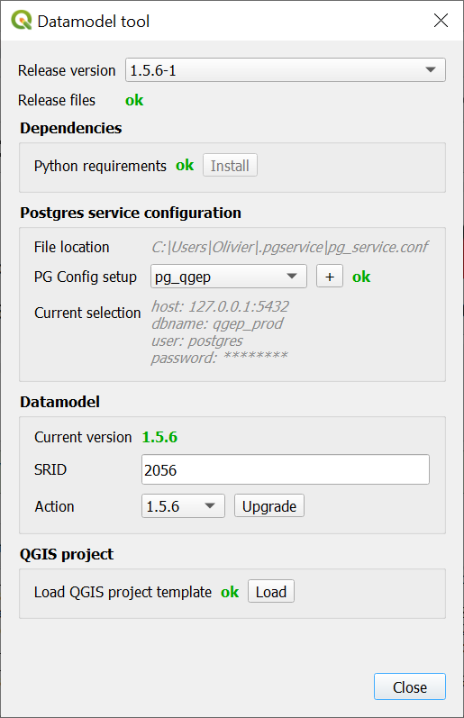

Data-model tool
===============

The plugin contains a data-model tool capable of initializing and upgrading a QGEP database.

It is aimed at system administrators and power users, and should not be used by end users, as it
could lead to data loss if not used properly.

For advanced cases, it is also possible to `upgrade your database manually <../db-update-pum/index.html>`_

Setup
-----

The data-model tool is hidden by default. To make it visible, you must first enable ``Admin mode`` 
in the plugin settings :

* Go to ``Plugin > QGEP > Settings``

* Switch to the ``Developer options``

* Check ``Admin mode``

* Restart QGIS

The data-model tool should now appear under ``Plugin > QGEP > Datamodel``

Usage
-----

Main dialog
^^^^^^^^^^^

The main dialog looks like this.

* **Release**:

    * **Version**: the version to retrieve the files from. Unless ``developper mode`` is enabled in the QGEP settings, only the latest stable version is available. Selecting anything different from the latest stable version should only ever be used on a testing database, as it could upgrade the database to an inconsistent state.

* **Python dependencies**:
    
    * **Install**: If there are missing requirements, click this to try to install them automatically. Note that this will not work on all systems. If it fails, you can try to start QGIS with administrator privileges, or `install the dependencies manually <../db-update-pum/index.html#requirements>`_.

* **Postgres service configurations**:

    * **File location**: shows the location of the ``pg_service.conf`` file being used

    * **PG Config**: allows to select the postgres service configuration of the database on which you want to operate.
    
    * **``Add`` button**: opens an utility to add or edit entries from your ``pg_service.conf`` file directly.
    
    Refer to the `installation guide <../../installation-guide/workstation.rst>`_ to know more about the ``pgservice.conf`` file.

* **Datamodel**

    * **Current version**: shows the current version of the datamodel found in the selected database

    * **SRID**: allows to customize the SRID (this is only supported on database initialization)

    * **Action**: allows to initialize or upgrade a datamodel to a specific version. WARNING: this will alter the datamodel in the specified database. Make sure you have a full and working backup of your database before performing an upgrade.

* **QGIS project**

    * **Load**: opens the template QGIS project, aleady configured to work on the database selected above

Troubleshooting
^^^^^^^^^^^^^^^

In case you encounter issues or errors when using the datamodel tool, make sure to look at the 
QGEP tab in the logs, as it may contain useful information (including errors returned by underlying tools).

Make sure to include this information if submitting a bug report or asking for support.
