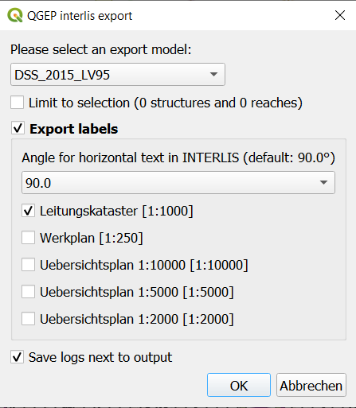
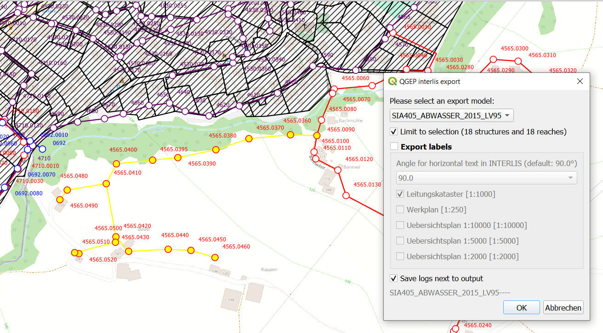

INTERLIS Data exchange
======================

This represents a guide on how to import/export data between QGEP and INTERLIS 2 Transfer Format (xtf).

General
^^^^^^^^^^^^^

The QGEP plugin includes an INTERLIS import/export feature.
It is currently capable of importing and exporting to the following models:
  + VSA-DSS 'DSS_2015_LV95'
  + SIA405 Abwasser 'SIA405_ABWASSER_2015_LV95`
  + VSA-KEK 'VSA_KEK_2019_LV95', which is an extension to the SIA405 wastewater model `SIA405_ABWASSER_2015_LV95` (for more details see `config <https://github.com/QGEP/qgepqwat2ili/blob/master/qgepqwat2ili/config.py>`_).

Note that currently, exports are possible in German only. Translated exports are on the roadmap, let us know if you are interested in this feature.
In `this blog post <https://www.sjib.ch/wie-uebersetze-ich-eine-interlis-transferdatei-in-eine-andere-sprache/>`_ the manual translation with the tool ili2db is explained in detail.

Prerequisites
^^^^^^^^^^^^^^

Java
--------
You need java on your system.

Windows : `Java for windows download <https://javadl.oracle.com/webapps/download/AutoDL?BundleId=245058_d3c52aa6bfa54d3ca74e617f18309292>`_
MacOS : `Java for MacOS download <https://javadl.oracle.com/webapps/download/AutoDL?BundleId=245051_d3c52aa6bfa54d3ca74e617f18309292>`_
Linux : use the package manager

Python libraries
-----------------
You need `sqlalchemy` and `geoalchemy2`.

To install : before launching QGIS, open OSGeo4W Shell

.. figure:: images/osgeo4wshell.jpg

and type::

   >>> pip3 install "sqlalchemy~=1.4" "geoalchemy2>=0.9.0"

If the command fails, try::

   >>> pip3 install --upgrade pip

.. note:: If pip cannot be found, make sure you’ve installed the python3-pip package using the OSGeo4W network installer (if you’ve installed the standalone version of QGIS, it should be included).

If this command still fails, try::

  >>> pip3 install --target=c:\somewhere\other\than\the\default --upgrade pip

where ``c:\somewhere\other\than\the\default`` is the path to your current pip package

The same `--target` flag can be added to install `sqlalchemy` and `geoalchemy2` in another location.

Modelbaker
-----------
The QGEP plugin will propose to install the Modelbaker plugin automatically. If that did not work, install the QGIS plugin `Modelbaker` manually from the QGIS plugin manager.

QGEP Version
-------------
The export only supports up-to-date QGEP datamodel (1.6.2 at the time of writing). Ensure your datamodel is fully updated before trying to import/export.

Usage (GUI)
^^^^^^^^^^^^^

Enable admin mode
-------------------------------------------------

In the `plugin>QGEP>settings` dialog, under the `Developer options` tab, ensure `Admin mode` is enabled. Restart QGIS.

.. figure:: images/settings_dialog.png

You should now see new `import` and `export` buttons in the QGEP toolbar.

Export
-------------------------------------------------

To export your QGEP data, click on the `export` button. The following dialog will appear.

Choose the model you want to export into.

.. note:: If you select VSA_KEK_2019_LV95 then two xtf files are created - SIA405_ABWASSER_2015_LV95 (the network data) and VSA_KEK_2019_LV95 (network and sewer TV data).

If you have an active selection in the nodes and/or reaches layer, you can choose to restrict the export to that selection. This is especially useful in combination with the upstream/downstream selection tools.

.. figure:: images/selection.png

When exporting a selection, there are not all records in all tables reduced to the selection. Wastewater structures, structure parts, wastewater networkelements, catchments, overflows are reduced, but other tables as pipe profiles or organisations are not reduced due to special cases, where it would be very difficult to select all necessary records.
If there are reaches with foregin keys to other reaches, that are not in the selection, then the selection will be expanded with this connected reach.

.. note:: Special case if there are wwtp_structure in the database or in the selection: Because wwtp_structure is not part of the SIA405 datamodel, the wastewater_structure (and the corresponding structure_parts) will not be exported. But the wastewater_networkelement will be exported without entry in fk_wastewater_structure. Like this, the hydraulic network stays correct.

The export tool is capable of exporting label positions for different scales. You can choose which scales you are interested in exporting by selected/deselecting them.

You can also change the angle for horizontal text in INTERLIS if your target system has another convention than INTERLIS.

Then, confirm the dialog and choose where to save the `.xtf` file.

.. note:: The export model name will be added to your filename that you choose. export.xtf will become export_DSS_2015_LV95.xtf

.. note:: Note that windows file pathes with empty strings in the directory path or filename are not supported at the moment.

.. note:: Note that for large/full exports, the command can take a long time.

.. note:: Note that QGIS standard behaviour for too long labels is to turn them horizontally (orientation = 0). You can adjust the properties of the vw_qgep_reach layer - Symbology - Placement - Label overrun from "no overrun" to e.g. 7 mm (Millimeter)

.. figure:: images/layer_vw_qgep_reach_label_overrun.png

.. note:: Note that remark fields are truncated to 80 characters on INTERLIS Export, as the INTERLIS definition is like this. If you have remark fields with more text then consider to move this data to documentation with the classes "file" and "data_media" so it can be exported to INTERLIS completely where you can add any document, photo or video to a class.

INTERLIS export starts with two integrity checks:

1. Integrity check Organisation subclasses
For VSA-DSS 2015 Export each organisation needs to be related to one of the seven subclasses of organisation (administrative_office, canton, cooperative, municipality, privat, wastewater_association, wastewater_treatment_plant).

.. figure:: images/interlis_export_integrity_checks_organisations_subclasses.png

If you get this error add a superclass reference by adding the value of the respective organisation in the corresponding organisation subclass.

.. figure:: images/add_organisation_subclass_reference.png

2. Integrity check identifiers
All export models define the identifier attribute as MANDATORY. Therefore the export tool first checks if there are identfiers that are NULL

.. figure:: images/interlis_export_integrity_checks_identifiers.png

You will get a list of missing identifiers per class. Please add an identifier. If you do not have a separte identifier scheme for that class just copy the obj_id.

Exports include a validation step using `ilivalidator`, which will inform you whether the export contains INTERLIS validation error.

Import
-------------------------------------------------

To import `xtf`files, click on the `import` button and navigate to the `.xtf` file.

.. note:: Note that windows file pathes with empty strings in the directory path or filename are not supported at the moment.

Click on `open` to select the import file.

The file will then be checked whether it contains data in one of the supported models.
Then a validation check with ilivalidator will take place in the background.

If the file is valid, then the import process will continue and the following dialog will appear.

.. figure:: images/import_dialog.png

The left part of this dialog lists all elements that are going to be imported from the `.xtf` file, allowing to review what is going to be imported and to deselect elements you may want to skip. It also shows the validation status of each object, showing whether further action is needed (INVALID) or recommended (WARNING) prior to importing.

The right part of this dialog shows a form specific to the type of element selected in the list, allowing to adapt the import. For instance, it allows to attach "examinations" to their pipes.

Once you're happy with the import options, confirm the dialog to persist the changes to your database.

Wait until you see the confirmation for a valid import.

Usage (command line)
^^^^^^^^^^^^^^^^^^^^^^

For advanced usage, the import/export tool can also be used as a command line tool. Please refer to https://github.com/QGEP/qgepqwat2ili/ for documentation about this.

Further Quality Control
^^^^^^^^^^^^^^^^^^^^^^^^^

Quality control of an export file with VSA online checker (Fachprüfung mit VSA Checker (online))
-----------------------------------------------------------------------------------

.. figure:: https://vsa.ch/wp-content/uploads/2020/04/Daten-checker-d-f-it.jpg

`For details see explanation on the VSA Homepage <https://vsa.ch/fachbereiche-cc/siedlungsentwaesserung/generelle-entwaesserungsplanung/datenmanagement/#GEP-Datachecker>`_

`Information about access and licensing you can get here <https://vsa.ch/Mediathek/gep-datachecker-jahresgebuehr/?media_filter_two=lizenzen-software>`_
