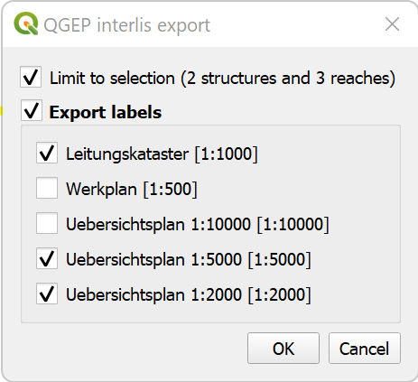

INTERLIS Data exchange
======================

This represents a guide on how to import/export data between QGEP and INTERLIS 2 Transfer Format (xtf).

General
^^^^^^^^^^^^^

The QGEP plugin includes an experimental interlis import/export feature.
It is currently capable of importing and exporting to the VSA-KEK 'VSA_KEK_2019_LV95', which is an extension to the SIA405 wastewater model `SIA405_ABWASSER_2015_LV95` (for more details see `config <https://github.com/QGEP/qgepqwat2ili/blob/master/qgepqwat2ili/config.py>`_). 

Note that currently, exports are possible in German only. Translated exports are on the roadmap, let us know if you are interested in this feature.
 
Prerequisites
^^^^^^^^^^^^^^

Java
--------
You need java on your system.

Windows : `download <https://javadl.oracle.com/webapps/download/AutoDL?BundleId=245058_d3c52aa6bfa54d3ca74e617f18309292>`_
Max : `download <https://javadl.oracle.com/webapps/download/AutoDL?BundleId=245051_d3c52aa6bfa54d3ca74e617f18309292>`_
Linux : use you package manager

 
Python libraries
-----------------
You need `sqlalchemy` and `geoalchemy2`.

To install : before launching QGIS, open OSGeo4W Shell, and type::

   >>> pip3 install "sqlalchemy>=1.3.22" "geoalchemy2>=0.9.0"

If the command fails, try::
 
   >>> pip install --upgrade pip

.. note:: If pip cannot be found, make sure you’ve installed the python3-pip package using the OSGeo4W network installer (if you’ve installed the standalone version of QGIS, it should be included).

If this command still fails, try:: 

  >>> pip install --target=c:\somewhere\other\than\the\default --upgrade pip
  
where ``c:\somewhere\other\than\the\default`` is the path to your current pip package

The same `--target` flag can be added to install `sqlalchemy` and `geoalchemy2` in another location.

Modelbaker
-----------
The QGEP plugin will propose to install the Modelbaker plugin automatically. If that did not work, install the QGIS plugin `Modelbaker` manually from the QGIS plugin manager (version 6.4 or newer).

QGEP Version
-------------
The export only supports up-to-date QGEP datamodel (1.5.6 at the time of writing). Ensure your datamodel is fully updated before trying to import/export.

Usage (GUI)
^^^^^^^^^^^^^

Enable admin mode
-------------------------------------------------

In the `plugin>QGEP>settings` dialog, under the `Developer options` tab, ensure `Admin mode` is enabled. Restart QGIS. 

.. figure:: images/settings_dialog.png

You should now see new `import` and `export` buttons in the QGEP toolbar.

.. figure:: images/toolbar.png

Export
-------------------------------------------------

To export your QGEP data, click on the `export` button. The following dialog will appear.

If you have an active selection in the nodes and/or reaches layer, you can choose to restrict the export to that selection. This is especially useful in combination with the upstream/downstream selection tools.

Then, confirm the dialog and choose where to save the `.xtf` file.

.. note::

  Note that windows file pathes with empty strings in the directory path or filename are not supported at the moment.

  Note that for large/full exports, the command can take a long time.

Exports include a validation step using `ilivalidator`, which will inform you whether the export contains validation error.

Import
-------------------------------------------------

To import `xtf`files, click on the `import` button and navigate to the `.xtf` file. 

.. note::
  Note that windows file pathes with empty strings in the directory path or filename are not supported at the moment.

The following dialog will appear.

.. figure:: images/import_dialog.png

The left part of this dialog lists all elements that are going to be imported from the `.xtf` file, allowing to review what is going to be imported and to deselect elements you may want to skip. It also shows the validation status of each object, showing whether further action is needed (INVALID) or recommended (WARNING) prior to importing.

The right part of this dialog shows a form specific to the type of element selected in the list, allowing to adapt the import. For instance, it allows to attach "examinations" to their pipes.

Once you're happy with the import options, confirm the dialog to persist the changes to your database.

Usage (command line)
^^^^^^^^^^^^^^^^^^^^^^

For advanced usage, the import/export tool can also be used as a command line tool. Please refer to https://github.com/QGEP/qgepqwat2ili/ for documentation about this.

Quality control
^^^^^^^^^^^^^^^^

Quality control with VSA online checker (Fachprüfung mit VSA Checker (online))
-----------------------------------------------------------------------------------
see https://www.vsa.ch/fachbereiche-cc/siedlungsentwaesserung/wegleitung-gep-daten/gep-datachecker/ 
-> Link to login at infogrips. 
