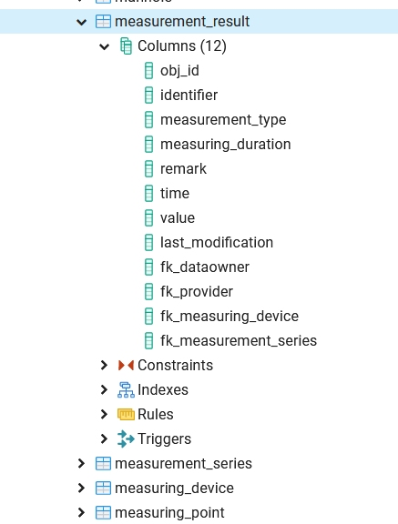

.. _Import-Results:

SWMM Import Results
===================

If you want to store the results in QGEP and use the dedicated view for the mapping then use SWMM Import Results.
It parses the report file of SWMM. 
The results are imported in the measurements tables in the ``qgep_od`` schema:

- ``measurement_result``, 
- ``measurement_series``, 
- ``measuring_device`` ,
- ``measuring_point`` .
  
and they populate a view dedicated for the mapping (see :ref:`mapping-imported`).

Launch ``SWMM Import results``:

- ``SWMM report file``: the ``.rpt`` file generated during the previous step
- ``Database``: The name of the PostgreSQL service hosting the QGEP database.
- ``Simulation name``: The name that you want to give to this simulation (it will appear in ``qgep_od.measuring_point.remark``).
- ``Import full results in addition to summary``: The full time series will be imported. Attention, if the report step is small, the import can take a long time.

Attention, a report file created from the SWMM GUI don't contain the full time series but only the summary.

