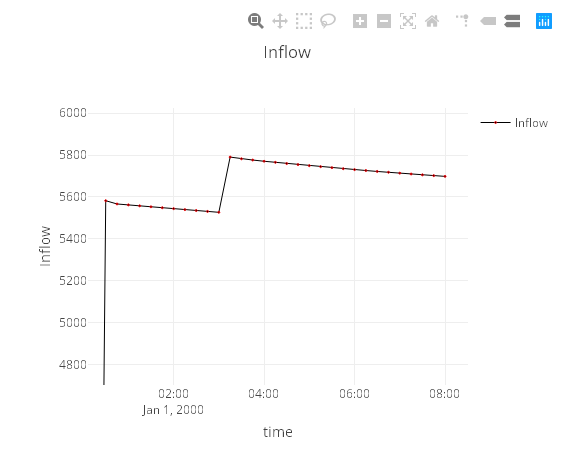

.. _Mapping:

Mapping
-------

.. _mapping-not-imported:

Results are not imported in QGEP
^^^^^^^^^^^^^^^^^^^^^^^^^^^^^^^^
Use processing tool ``join attributes`` to add the results stored in the tables ``Node summary`` and ``Link summary`` to the tables ``qgep_od.vw_wastewater_node`` and ``qgep_od.vw_qgep_reach``.
The mapping should be done on the attribute ``obj_id`` of the ``qgep_od`` tables and the attribute ``id`` of the summary tables.

.. figure:: images/map_link_summary.jpg
.. figure:: images/map_node_summary.jpg

.. _mapping-imported:

Results are imported in QGEP
^^^^^^^^^^^^^^^^^^^^^^^^^^^^
* Add the layers qgep_swmm.node_results and / or qgep_swmm.link_results to your QGIS project
* Filter by the name of the simulation and the name of the parameter to show: Right click on the layer > filter > Expression: ``"swmm_simulation_name" = 'name of the simulation AND "swmm_parameter" = 'inflow'``

Two template QGIS files are provided in the plugin folder ``src\swmm_templates\*.qgs``

The project ``swmm_summary.qgs`` show how the summary indicators can be loaded in QGIS. The project ``swmm_full_report.qgs`` show how the full time series can be loaded in QGIS. You will need to adapt the services and the filters.

Show the indicators evolving along time
“““““““““““““““““““““““““““““““““““““““
This manipulation only works with complete times series. Namely, you need to import the full results and not only the summary.

**Play the simulation with Time Manager**

* Install / activate the plugin *Time Manager*
* Parameter > Add a layer
	* Start time: time
	* End time: Same as start
* Time frame size: Same as the swmm export time step

.. figure:: images/time_manager_add_layer.jpg

.. figure:: images/time_manager_inflow_example.gif

**Plot values along the time with DataPlotly**

* Install / activate the plugin *DataPlotly*
* Graph type: *Scatter Plot*
* Activate: *Use only selected features*
* Choose the layer
* Field X: *time*
* Field Y: *value*
* Marker type: *Line*
* Select the object that you want to plot: every nodes or links with the same id (you can select them from the map or from the table).

.. figure:: images/DataPlotly_parameters.jpg

