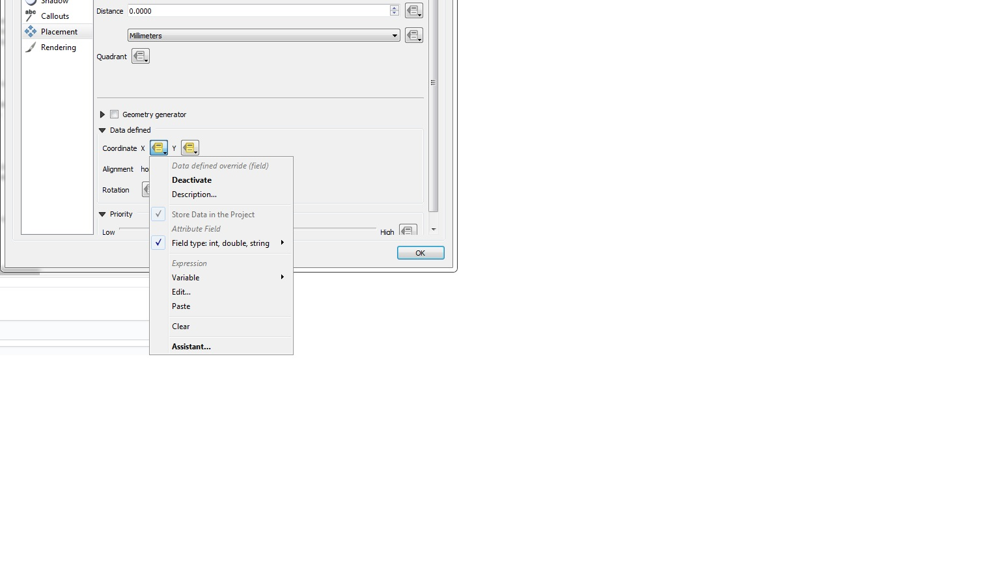

How To
======
This represents a guide on different themes about configuring in QGEP.

Manual Label-positioning for different scales
---------------------------------------------
QGIS label definition can handle different labels for different scales. This works very well if you work on the screen. 
If you have to print plans with labels or if you have to export labels for data exchange (e.g. exchange with RegioGIS-platform), it will often be necessary to determine the label positions manually.
If a label is positioned manually in QGIS, this fixed position applies to every scale. And that's not always a good result.

Solution

* Extend the Auxiliary Storage File with new fields for different labelpositions

* Use Rule-based labeling, then you can define different labelpositions for every rule 

In the example below, we want to label the wastewater-structures with a detailed label for network_plan (1:500) and for overviewmap (1:2000).
In the Auxiliary Storage we use the standard fields PositionX and PositionY for the  network_plan labels. For the overviewmap labels we add two new fields.
We name this fields posx2000 and posy2000.

.. figure:: images/man_labeling_newfields.jpg

Define now rule-based labeling with two rules. In the example the first rule is called WP-Labels (WP = Werkplan = network_plan). 
You have not the change something in the placement, because this rule uses the standard positioning-fields.

.. figure:: images/man_labeling_rules.jpg

The second rule is called UP-Labels (UP = Uebersichtsplan = overviewmap). In this rule, you have to change the coordinate fields in the placement-tab.

.. figure:: images/man_labeling_edit_rules.jpg

Click on Coordinate X menutool and choose in the field type-menu the auxiliary_storage_user_custom_posx2000 field. Then the similar for Y.

.. attention:: Do not use the **Edit...** menu for defining the coordinate-field. If you use a formula or choose the field via the Edit... menu, QGIS will overwrite the definition everytime you do a manual positioning.

Now you can move or fix your labels for every rule with different positions with the QGIS **Moves a Label or Diagram**-Tool. 

.. figure:: images/man_labeling_labeltools.jpg

.. attention:: Your changes are only saved if you save the QGIS-project!

How to import existing label-positions
--------------------------------------
Good label-positions can be hard work. So you don't want to loose it.

* Export your label-positions from your old system in the form obj_id, coordinateX (east), coordinateY (north).

* Add the **.qgd**-file of your project with **Add Vector Layer...** to your project and open the attribute table.

.. figure:: images/man_labeling_auxtable.jpg

If you can not find a .qgd-file, then you have probably not moved or rotated a label before.

* Change the field-names in your export-data to the field-names in the qgd-file. In the example the obj_id-field must have the name **ASPK**, the coordinate-fields must have the names **labeling_positionx** and **labeling_positiony**.

* Open the export-file in the QGIS-project and copy the rows you want to the table of the qgd-file (this file must be editable).

* Save the qgd-file and remove it from your project, before you remove labels, because QGIS can not save manual label-positions, if the qgd-file is a layer in the project.

* If necessary define the horizontal/vertical alignment of your label-coordinates in the placement of the label definition.

