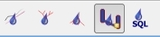

Data entry
==========

There are basically two ways:

* Data entry by constructing or digitizing in the QGEP with the QGEP-wizard or QGIS-tools itself
* Data entry in an external program or software and then importing the position and/or technical data into QGEP e.g.:

   * coordinates from manholes from measurement
   * position and/or technical data from another GIS or CAD system
   * using data from the surveyor (e.g. property boundaries) as a basis for defining catchment borders
   * other

Data entry in QGEP needs some understanding of the underlaying data model `VSA-DSS <http://dss.vsa.ch>`_, but is supported with some great data collecting wizards and forms that link the different tables correctly together. Especially the linking of manholes and reaches to a complete sewer network is highly automated and can be controlled with the network following tool.

The QGEP wizard
---------------

The QGEP wizard helps digitizing manholes and reaches with just a few clicks.

To start with data entry select the QGEP button **Wizard**.

On the left side bottom, **QGEP Data Entry** window appears:

.. figure:: images/wizard_data_entry.jpg

Click **Start Data entry** to enter the edit mode. 

Choose **Wastewater Structure** or **Reach**. Start adding new feature.

There is no need to select the correct layer in the layers-window, you do not need to toggle editing or to choose the add feature tool.

When adding new wastewater structures, the wizard has no additional functionality. To **Reuse the last entered attribute values**, it is necessary (and recommended) to enable this option in :menuselection:`Settings --> Options --> Digitizing`.

When adding new reaches, the wizard has some additional functionality:

* Snapping on wastewater nodes and other reaches is on, even if QGIS enable snapping is off.
* Snapping on nodes is always preferred to snapping on reaches.
* When the new reach snaps, then the obj_id_links are automatically entered in the field fk_fields of the reach points.
* The **Reuse the last entered attribute values** - option of QGIS does not work. But the standard-fields on the general-tab (and only those fields) do reuse the last entered attribute value 

General
-------

.. note:: When digitizing, you start with the point elements (wastewater structures such as manholes, special structures). Afterwards its easy to connect those points with line elements (channels with reaches).

