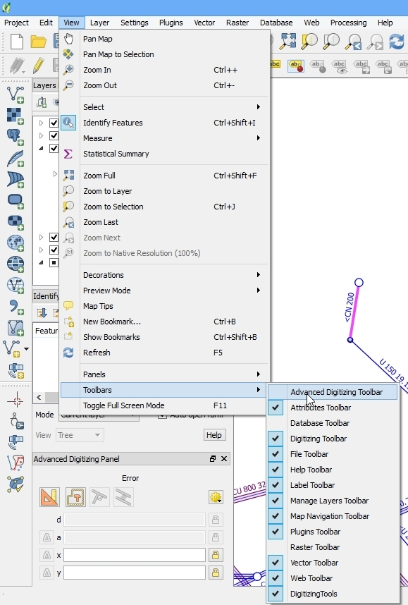
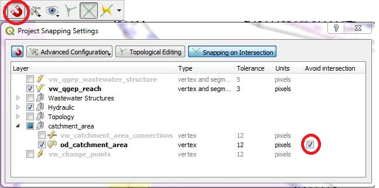
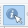

Digitizing Catchment Areas
===========================

General
-------

Catchments can be digitized with QGIS standard tools.

.. figure:: images/qgis_standard_tools.jpg

Catchment areas should not overlap and can have 4 connections to wastewater nodes.

So enable the **Advanced digitizing toolbar** in the **View** --> **Toolbars Menu**

Digitizing
----------
* Select the **Enable Snapping** button

.. figure:: images/enable_snapping_button.jpg

* Open the **Project Snapping Option Settings**, check the **od_catchment_area** layer and check the **avoid intersection** checkbox for the od_catchment_area layer

.. note:: new digitized catchement areas will not overlap with existing catchment areas with this settings.

* Set the layer ``od_catchment_area`` into the edit mode.
* Use the **Add Feature** tool to digitize a new area.

.. figure:: images/add_feature_tool.jpg

* TO DO - add next points

Editing
-------

* You can edit existing areas with the **Identify features** tool.

