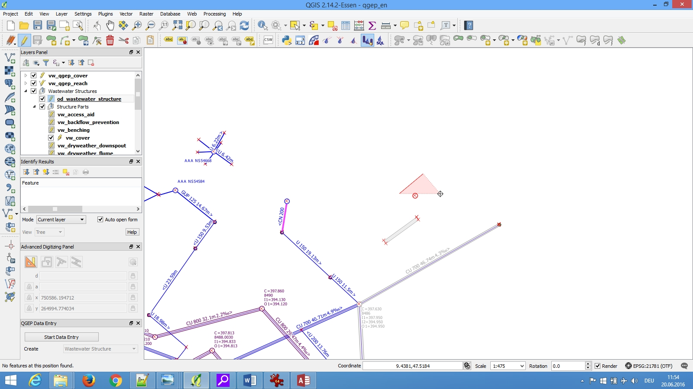
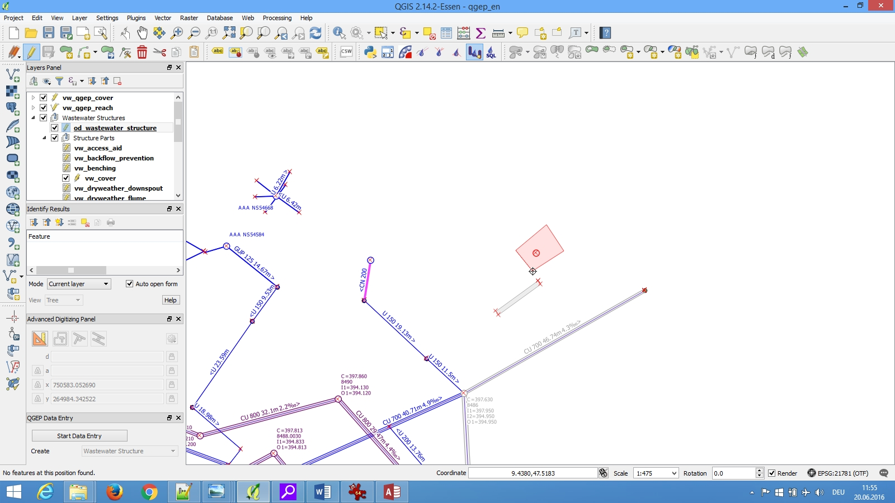

Digitizing detailed geometry
============================

General
-------

You can add a detailed geometry to waste water structures.

This is recommended for:

* Special structures and discharge points, because they are not normed structures like manholes,
  where you can define **dimension1** and **dimension2** to describe the extension.
* Infiltration installations where **dimension1** and **2** are not enough to describe the geometry

.. attention:: Detailed geometry is usually not used for manholes or channels!

Digitizing tool
---------------

* Select the **vw_qgep_wastewater_structure** layer
* Select the object where you want to add a detailed geometry with the info tool
* Right click the object 
* if there are several objects: select the **vw_qgep_wastewater_structure** layer
* Choose **Digitize**

.. figure:: images/digitizing_detailedgeometry1.jpg

* You can now start digitizing the polygon. 

* Right click to stop.

.. figure:: images/digitizing_detailedgeometry4.jpg

An other way is to open the **vw_qgep_wastewater_structure** form with the info tool and then choose **Digitize** in the **Aktionen** menu of the form.
