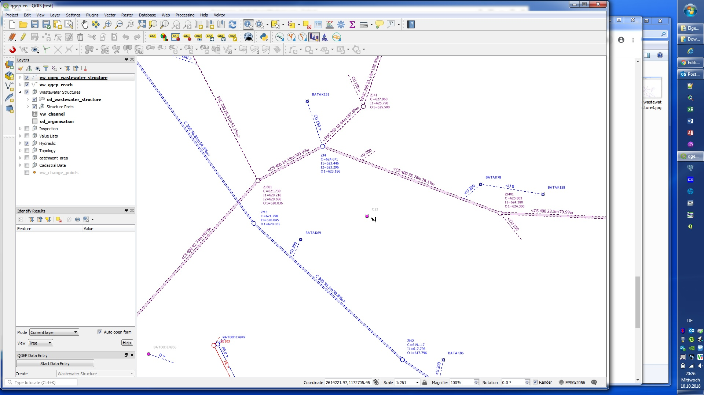

Digitizing Wastewater Structures 
=================================

General
-------

QGEP has a wizard to correctly collect manholes and special structures.

Select the **Wizard** button, then click **Start Data Entry** and choose **Wastewater Structure** in the pull down menu.

.. figure:: images/wizard_data_entry.jpg

.. figure:: images/wizard_wastewater_structure3.jpg

Digitizing
----------

Now the cursor changes to the digitizing symbol and you can select the location of the new point element.

Then the **vw_qgep_wastewater_structure** form opens and you can start adding data in the **General** tab:

.. figure:: images/wizard_wastewater_structure_manhole_form_ws_type3.jpg

Select the ws_type you want (preselected is 'manhole'):

- manhole
- special_structure
- discharge_point
- infiltration_installation

Then add the identifier (this is the attribute that will be displayed on the map).

.. note:: If you do not enter an identifier, QGEP will enter the obj_id also as identifier (you can change later). As default, the identifier of the wastewater structure is also the identifier of the cover and of the wastewater node.

Depending on the **ws_type**, you will have different fields and tabs in the form.

Add other attributes in the **General** tab. 
You can also add attributes in the other tabs (Cover, Wastewater Structure, Manhole, WasteWater Node).

.. attention:: You can not add new records in the tabs **Covers**, **Structure Parts**, **Wastewater Nodes** and **Maintenance**, because you have to save first the Wastewater Structure-record to the database before you can add additional records.
You can not use **Actions** for the same reason. First safe the record.

Click OK to close the form.

.. figure:: images/wizard_wastewater_structure_manhole_form_data_ok3.jpg

Save the information of this layer by stopping the data entry wizard

.. figure:: images/stop_data_entry.jpg

You can re-edit your point object selecting the edit mode and then click with the info cursor on the object you want to edit.
If you do not select the edit mode, you can just look add the existing data.

For detailed information about editing see the :ref:`editing-data` chapter.

Further attributes and classes
------------------------------

When a wastewater_structure object is digitized a series of steps take place in the background in the QGIS database:

a) an new object in the class wastewater structure is added

b) a new object in the respective subclass [discharge_point, infiltration_installation, manhole, special_structure] is added and linked

c) a new cover object is added and linked to the wastewater structure

d) a new wastewater node object is generated in wastewater network elements and its subclass wastewater nodes

To add additional objects such as structure parts (besides covers there are access aids, backflow prevention etc) you have to save first and then edit the point object (see the :ref:`editing-data` chapter).

.. note:: To add a second cover or a second wastewater node to a wastewater structure, see the :ref:`editing-data` chapter.

..(take more from GEPView-Howto 1.2. Chapter 4.1)
