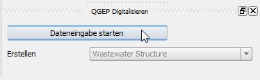
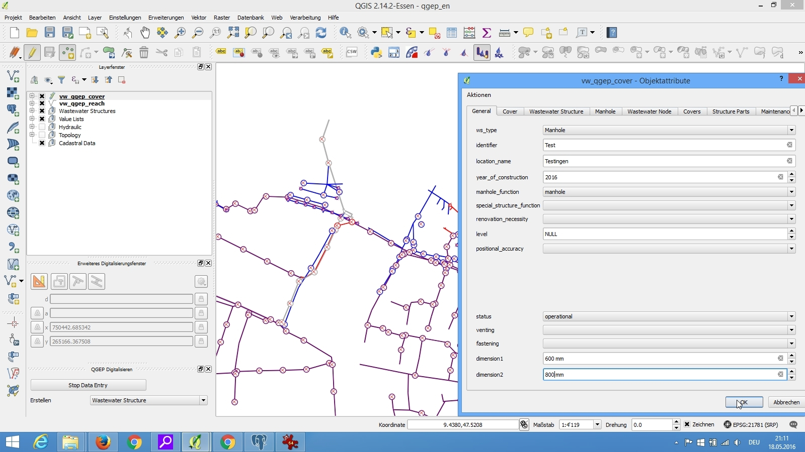

Digitizing Waste water structures 
=================================

General
-------

QGEP has a wizard to correctly collect manholes and special structures.

Select the **Wizard** button, then click **Start Data Entry** and choose **Wastewater Structure** in the pull down menu.

.. figure:: images/wizard_wastewater_structure.jpg

Digitizing
----------

Now the cursor changes to the digitizing symbol and you can select the location of the new point element.

.. figure:: images/wizard_data_entry_with_new_cursor.jpg

Then the **vw_gep_cover** form opens and you can start adding data in the **General** tab:

.. figure:: images/wizard_wastewater_structure_manhole_form_ws_type.jpg

Select the type you want:

- discharge_point
- infiltration_installation
- manhole
- special_structure

Then add the identifier (this is the attribute that will be displayed on the map).

For manholes and special structures you then choose the function (in **manhole_function**
or in **special structure_function**). It will be automatically displayed or hidden in the
future depending on the **ws_type**)

.. figure:: images/wizard_wastewater_structure_manhole_form_data_manhole_function.jpg

Add other attributes in the **General** tab. Now you can click OK.

Save the information of this layer by stopping the data entry wizard

.. figure:: images/stop_data_entry.jpg

You can re-edit your point object selecting the edit mode and then click with the info cursor on the object you want to edit.
If you do not select the edit mode, you can just look add the existing data.

.. figure:: images/manhole_info_manhole.jpg

For detailed information about editing see the :ref:`editing-data` chapter.

Further attributes and classes
------------------------------

When a point object is digitized a series of steps take place in the background in the QGIS database:
a) an new object in the class wastewater structure is added
b) a new object in the respective subclass [discharge_point, infiltration_installation, manhole, special_structure] is added and linked
c) a new cover object is added and linked to the waste water structure
d) a new wastewater node object is generated in wastewater network elements and its subclass wastewater nodes
e) When you add additional objects such as structure parts (besides covers there are access aids, backflow prevention etc)
then QGEP automatically generates the objects in the needed tables and subtables and sets the foreign keys to the waste water structure.

..(take more from GEPView-Howto 1.2. Chapter 4.1)
