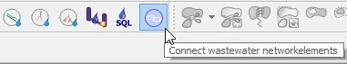

.. _connect-wastewater-network-elements:

Connect Wastewater Network Elements
===============================================

This represents a guide on how to connect wastewater network elements in QGEP.

General
------------

* QGEP has a tool to connect wastewater network elements

Connecting
-----------

* See `this video tutorial to see how it works: <https://vimeo.com/171536774>`_

Remark
-----------

* A reach point from (rp_from_fk_wastewater_networkelement) should never be connected to another reach.
* For example, when you have a reach discharging directly into another one without a structure between the two,
  the upstream reach should be connected to the downstream reach (rp_from_fk_wastewater_networkelement = downstream reach). 
  But inversely, the downstream reach shouldn't be connected to the upstream one.
 
* To Do: Add picture for the example
