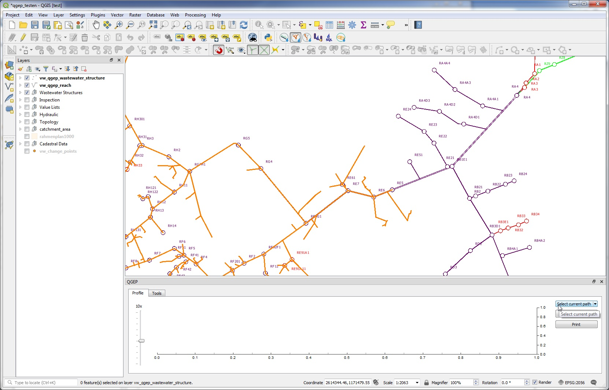
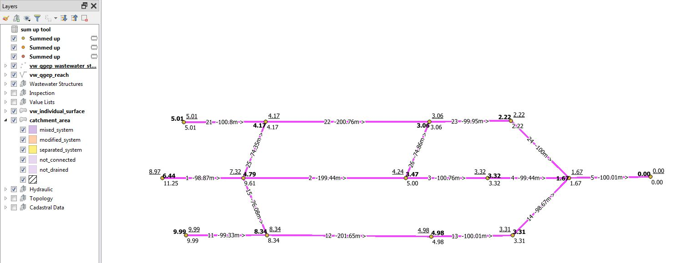

Network following tools
=======================

Refresh network topology
------------------------

* Before using the network following tools, be sure, that your network topology is updated

* To refresh the network topology, you select the layer **vw_qgep_reach** and set the layer to the edit mode

* Click the **refresh network topology** tool (Button with SQL and drip)

* If ok, there is a message: **Success: Network successfully updated**

Upstream
--------

* It does not matter, which layer is selected

* To start upstream network following select the **Upstream** QGEP button 

.. figure:: images/network_upstream_button.jpg

* QGEP opens then profile window at the bottom of the map. Click on your start node. 

* If there is more than one node in this area, you choose the one you want form the mouse-list

.. attention:: With qgepplugin 1.1.8 / QGIS 3.4.2, it's a good idea to zoom in so far, that you can choose your start node without having any other node nearby. If you choose the node from the mouse-list, you may get unexpected results.

.. figure:: images/network_select_start_node.jpg

* After a few seconds all upstream reaches will be highlighted and you can see where the water is coming from.

* If you want to select the highlighted reaches, then click on the **Select current path** button in the profile window

* You can now work with your reach selection in the attribute table or zoom to the selected reaches (if the vw_qgep_reach layer is selected)

* Use this tool to check if the topology of your network is correct.

.. note:: In the button select current path, you have a menu **Configure Select**. This is prepared to select later not only the path, put also the catchment areas that are connected to the path. This feature is not working with qgepplugin 1.1.8.

Downstream
----------

* Downstream network following works similar as the Upstream network following described above.

.. figure:: images/network_downstream_button.jpg

* You can see where the water is going to. 

* Control, if QGEP finds also the overflows

* Use this to check whether the topology of your network is correct or to find out where you could intervene in case of an accident.

.. _SumUpUpstream:

Sum up upstream
---------------

* This is a tool in the QGEP-toolbox.

* The idea for this tool is to sum up a value over the whole network of chanels, e.g. the flowtime for each point to the outlet of the network.

* For this tool you need a field in the layer vw_qgep_reach with the values to sum up. Because interesting values are normally not part of this layer, you have first to join the value-field (e.g flowtime or flow rate) to the layer vw_qgep_reach.

* As example look at this small network, labeled with reach-identifier, length and flow direction arrow

.. figure:: images/sumupupstream-example.jpg

* We need a table (in the example called sum up tool) with at least two fields: field identifier for the join and field flow rate (in the example in [m/s]) to sum up.
* Open the properties of layer vw_qgep_reach, choose **Joins** and **Add new join** (green + Button) and define the join with the join field (identifier) and the joined fields (field to sum up).

.. figure:: images/sumupupstream-join1.jpg

* Start the tool with double-click one **Sum up upstream**

.. figure:: images/toolbox.jpg
.. figure:: images/qgep_toolbox.jpg

* In the window you have to enter/to choose 

  * an expression as shown in the titel of the field (COALESCE("field_name",0). If you do not use the **coalesce** command, you will get an error when running the tool and there are NULL-values in the field to sum up. In the figure is as example the calculation for the flow time in [minutes], calculated with length effective and the flow rate in [m/s]. 

  * the branch behavior (Minimum, Maximum, Average): which value will be used after when two branches join to continue the summing.
  
  * the advanced paramaters are preconfigured for QGEP and should not need to be changed.
  
  * Summed up: if you let this field empty, there will be a temporary point layer with the results in your project. Otherwise you can save the results to a new point vector layer.
  
.. figure:: images/sumupupstream-tool.jpg

The resulting point-vector layer has the fields of the vw_wastewater_node layer and an additional field **value** with the sum for each wastewater node.
* In the figure below you see the result of the example with all three branch behaviours: minimum = normal style, maximum = bold, average = underscored

Flow times downstream
---------------------

* This is a tool in the QGEP-toolbox.

* The idea for this tool is to get the flowtime between a startpoint (where e.g.is an accident) and an interesting wastewater structure downstreams. It is not the idea to create a flowtime plan for a whole network with this tool (use the SumUpTool_ tool for this task).

* For this tool you need a layer (table) in the QGEP-project with the flowtime per reach and the obj_id of the reach.

* You have to select the start-reach (where the accident is) in the vw_qgep_reach-layer

* Start the tool with double-click one **Flow times downstream**

.. figure:: images/toolbox.jpg
.. figure:: images/qgep_toolbox.jpg

* In the window you have to choose 

  * as reach layer: vw_qgep_reach

  * as flow time layer: your table with the reach obj_id and the flowtimes (or the values you want to sum-up downstream)
  
  * as reach id field: the field in your table that is the obj_id of the reach
  
  * as Flow times field: the field in your table, that you want to sum-up
  
  * as Flow times: if you let this field empty, there will be a temporary file with the results in your projects. Otherwise you can save the results to a vector layer.
.. figure:: images/flow_time_downstream_window.jpg

* The tool makes a downstream network search starting with the selected reach and creates for every reach a record in the (temporary) vector layer with just one field (the sum of the Flow times).
.. figure:: images/flow_time_downstream_result.jpg

.. attention:: If there is more than one downstream-way, the results are wrong after the branch.

* There are some cases, where you get an empty flow time-Layer and red (error) text in the Log-window:
 
  * Do not select more than one reach to start
 
  * Do not select vw_qgep_reach as flow time layer (to sum-up the length, use the vw_network_segment layer)
  
  * If the reach id field has no values that match the reach obj_id, you will also get an error
