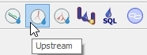

Network following tools
=======================

This represents a guide on how to use the network following tools in QGEP.

Downstream
----------

* To start downstream network following select the QGEP button "downstream"

.. figure:: images/downstream_button_selected.jpg

* After a few seconds all downstream reaches will be highlighted and you can see, where the water is going to. 

.. figure:: images/downstream_result.jpg

* Use this to check whether the topology of your network is correct. Or to find out, where you could intervene in case of an accident.

Upstream
--------

* To start upstream network following select the QGEP button "upstream". 

* Then select the manhole.

.. figure:: images/upstream_start_selection.jpg

* After a few seconds all upstream reaches will be highlighted and you can see, where the water is coming from. 

.. figure:: images/upstream_result.jpg

* Use this to check whether the topology of your network is correct.