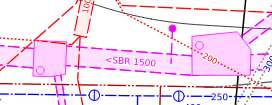

.. _QGEP User Guide:

Network following tools
=======================

This represents a guide on how to use the network following tools in QGEP.

TO DO: Explain how it works

Titel
------------------------------

Subtitle
^^^^^^^^^^^^^^^^^

* List
  * Subpoint
  
Link:
add `link <http://www.postgresql.org/docs/current/static/libpq-pgpass.html>`_

Add some screen shots 

