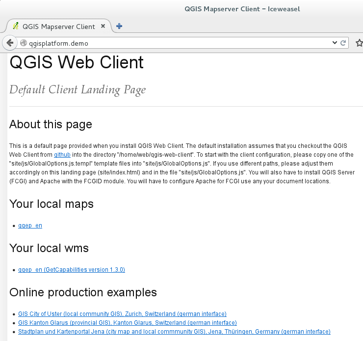

QGIS Server
===========

You can download a VM with an older QGEP setup that also
has QGIS Server installed from http://docs.qtibia.ro/qgisplatform.vdi.xz .

The VM has working installations of
`QGIS Server <https://docs.qgis.org/latest/en/docs/user_manual/working_with_ogc/ogc_server_support.html>`_
and `QGIS Web Client (QWC). <https://github.com/qgis/QGIS-Web-Client>`_

Access the Web Services
^^^^^^^^^^^^^^^^^^^^^^^

The Apache server is setup to respond to requests pointing to the `http://qgisplatform.demo`.
Accessing the above link with the Internet Browser of the VM will take you to the starting
page of QWC depicted in the below image.

   **QGIS Web client starting page**

If you want to access the web services outside the VM, you need to edit the ``hosts`` file on
your machine and point ``qgisplatform.demo`` to the IP of the VM.

.. note::

 If you've setup the VM with the network adapter in NAT mode only the VM host will
 be able to access the services. If you want all the devices on your LAN to do it,
 you need to setup the network adapter in bridge mode.
